# Polyglot Codebase Knowledge Graph

> Generated offline by **readmenator**. Supports C, C++, Python, Go, Rust, JS/TS, Java, C#, Shell, PHP, Dart, GDScript, Nim, ASM, Ruby, Swift, Kotlin, Scala, Lua, Elixir.
> No LLMs. No tokens. Pure static analysis. See more [here](https://github.com/grisuno/ReadMenator)

**Total Files Parsed:** 2 | **Total Symbols Extracted:** 71 | **Total Imports:** 19

<!-- ranking_model: v1.0 | weights: {ppr:0.45,auth:0.2,test:0.15,doc:0.1,fresh:0.1} | alpha:0.85 | commit:4c8e0d2 | date:2026-07-18 -->


## Table of Contents

1. [Statistics Dashboard](#statistics-dashboard)
2. [Architectural Layers](#architectural-layers)
3. [Ranked Context](#ranked-context)
4. [God Nodes](#god-nodes)
5. [Suggested Questions](#suggested-questions)
6. [Hotspot Analysis](#hotspot-analysis)
7. [Change Impact Analysis](#change-impact-analysis)
8. [Suggested Linting Rules](#suggested-linting-rules)
9. [Orphans](#orphans)
10. [Query Recipes](#query-recipes)
11. [Structural Knowledge Map](#structural-knowledge-map)
12. [UML Class Diagram](#uml-class-diagram)
13. [Code Property Graph](#code-property-graph)
14. [Architecture Reference](#architecture-reference)
    - [PY (1 files)](#py-1-files)
    - [SH (1 files)](#sh-1-files)

---

## Statistics Dashboard

| Metric | Value |
|--------|-------|
| Total Files | 2 |
| Total Symbols | 71 |
| Total Imports | 19 |
| Call Edges | 279 |
| Inheritance Edges | 3 |
| Languages | 2 |
| Avg Symbols/File | 35.5 |
| Avg Imports/File | 9.5 |

### Top Files by Import Count (Fan-Out)

| File | Imports | Symbols | Language |
|------|---------|---------|----------|
| `fakesystemd.py` | 19 | 71 | py |

---

## Architectural Layers

Auto-detected from path patterns, naming conventions, and imported frameworks.

| Layer | Files |
|-------|-------|
| utility | 2 |

### utility

- `fakesystemd.py` (py, 71 symbols)
- `install.sh` (sh, 0 symbols)

---

## Ranked Context

Files ranked by composite score for the current query context. The ranking combines Personalized PageRank (query relevance), global authority, test coverage, documentation coverage, and code freshness. Model: v1.0.

| Rank | File | Composite | PPR | Authority | Test | Doc |
|------|------|-----------|-----|-----------|------|-----|
| 1 | `fakesystemd.py` | 0.0028 | 0.0000 | 0.0000 | 0.00 | 0.03 |
| 2 | `install.sh` | 0.0000 | 0.0000 | 0.0000 | 0.00 | 0.00 |

**Query anchors:** fakesystemD/fakesystemd.py

**Top result justification paths:**

  `fakesystemd.py`

---

## God Nodes

Most architecturally central files ranked by combined import/export degree and symbol richness.

| File | Score | Connections | PageRank |
|------|-------|-------------|----------|
| `fakesystemd.py` | 7.1 | | 0.0000 |
| `install.sh` | 0.0 | | 0.0000 |

---

## Suggested Questions

Auto-generated exploration prompts based on graph structure:

- What does fakesystemd.py depend on, and what depends on it? (0 connections)
- What does install.sh depend on, and what depends on it? (0 connections)
- What is UnitConfig in fakesystemd.py and how is it used?
- What is the overall architecture of this codebase?

---

## Hotspot Analysis

Files ranked by combined complexity (symbol count) and centrality (connection count). High-scoring files are architecturally critical and may need refactoring attention.

| File | Complexity | Centrality | Combined | Symbols | Connections |
|------|-----------|------------|----------|---------|-------------|
| `fakesystemd.py` | 1.000 | 1.000 | 1.000 | 71 | 19 |
| `install.sh` | 0.000 | 0.000 | 0.000 | 0 | 0 |

---

## Change Impact Analysis

Files sorted by how many other files would be affected if they changed. High-impact files should be changed with caution.

| File | Direct Dependents | Transitive Dependents | Total Impact |
|------|------------------|----------------------|--------------|
| `fakesystemd.py` | 0 | 0 | 0 |
| `install.sh` | 0 | 0 | 0 |

---

## Suggested Linting Rules

Automatically suggested linting and security rules based on patterns detected in the codebase. These can be exported as Semgrep rules using the `--export-rules` flag.

| Rule ID | Severity | Description | Language | Matches |
|---------|----------|-------------|----------|---------|
| `RM001` | info | Large number of functions in py: 63 total | py | 63 |

---

## Orphans

Files with no documentation or low connectivity. These are candidates for documentation investment or cleanup.

- `install.sh` (0 symbols, no doc)

---

## Query Recipes

Example queries you can run against this knowledge base using the ranking engine:

```
# Find files most relevant to a concept
readmenator query "Where is the import resolver implemented?"

# Rank files by relevance to a topic
readmenator query "How does documentation generation work?"

# Explain why a file ranks highly
readmenator query "explain readmenator/_documentation.py"

# Trace dependency paths with ranked context
readmenator query "path from CLI to exporter"
```

The ranking model uses the following signals:

- **Personalized PageRank** (45% weight): query-specific relevance via seed propagation
- **Global Authority** (20% weight): structural importance via standard PageRank
- **Test Coverage** (15% weight): fraction of symbols referenced in test files
- **Doc Coverage** (10% weight): presence of docstrings and file-level docs
- **Freshness** (10% weight): recent modification activity

Results include score decomposition and justification paths for each ranked item.

---

## Structural Knowledge Map

```mermaid
graph TD
    classDef mod fill:#1e1e1e,stroke:#ff6666,stroke-width:2px,color:#fff;
    classDef cls fill:#2d2d2d,stroke:#4ec9b0,stroke-width:2px,color:#fff;
    classDef fn fill:#333,stroke:#dcdcaa,stroke-width:1px,color:#dcdcaa;
    classDef ext fill:#111,stroke:#666,stroke-dasharray:5 5,color:#aaa;
    fakesystemD_fakesystemd_py["fakesystemd.py (py)"]
    class fakesystemD_fakesystemd_py mod;
    fakesystemD_fakesystemd_py_UnitConfig["UnitConfig"]
    class fakesystemD_fakesystemd_py_UnitConfig cls;
    fakesystemD_fakesystemd_py --> fakesystemD_fakesystemd_py_UnitConfig
    fakesystemD_fakesystemd_py_JobConfig["JobConfig"]
    class fakesystemD_fakesystemd_py_JobConfig cls;
    fakesystemD_fakesystemd_py --> fakesystemD_fakesystemd_py_JobConfig
    fakesystemD_fakesystemd_py_Config["Config"]
    class fakesystemD_fakesystemd_py_Config cls;
    fakesystemD_fakesystemd_py --> fakesystemD_fakesystemd_py_Config
    fakesystemD_fakesystemd_py_Unit["Unit"]
    class fakesystemD_fakesystemd_py_Unit cls;
    fakesystemD_fakesystemd_py --> fakesystemD_fakesystemd_py_Unit
    fakesystemD_fakesystemd_py_Job["Job"]
    class fakesystemD_fakesystemd_py_Job cls;
    fakesystemD_fakesystemd_py --> fakesystemD_fakesystemd_py_Job
    install_sh["install.sh (sh)"]
    class install_sh mod;
    ext_sys["sys"]
    class ext_sys ext;
    fakesystemD_fakesystemd_py -.->|imports| ext_sys
    ext_os["os"]
    class ext_os ext;
    fakesystemD_fakesystemd_py -.->|imports| ext_os
    ext_json["json"]
    class ext_json ext;
    fakesystemD_fakesystemd_py -.->|imports| ext_json
    ext_time["time"]
    class ext_time ext;
    fakesystemD_fakesystemd_py -.->|imports| ext_time
    ext_threading["threading"]
    class ext_threading ext;
    fakesystemD_fakesystemd_py -.->|imports| ext_threading
    ext_socket["socket"]
    class ext_socket ext;
    fakesystemD_fakesystemd_py -.->|imports| ext_socket
    ext_logging["logging"]
    class ext_logging ext;
    fakesystemD_fakesystemd_py -.->|imports| ext_logging
    ext_signal["signal"]
    class ext_signal ext;
    fakesystemD_fakesystemd_py -.->|imports| ext_signal
    ext_grp["grp"]
    class ext_grp ext;
    fakesystemD_fakesystemd_py -.->|imports| ext_grp
    ext_pwd["pwd"]
    class ext_pwd ext;
    fakesystemD_fakesystemd_py -.->|imports| ext_pwd
    ext_tempfile["tempfile"]
    class ext_tempfile ext;
    fakesystemD_fakesystemd_py -.->|imports| ext_tempfile
    ext_array["array"]
    class ext_array ext;
    fakesystemD_fakesystemd_py -.->|imports| ext_array
    ext_dataclasses["dataclasses"]
    class ext_dataclasses ext;
    fakesystemD_fakesystemd_py -.->|imports| ext_dataclasses
    ext_typing["typing"]
    class ext_typing ext;
    fakesystemD_fakesystemd_py -.->|imports| ext_typing
    ext_dbus["dbus"]
    class ext_dbus ext;
    fakesystemD_fakesystemd_py -.->|imports| ext_dbus
    ext_dbus_service["dbus.service"]
    class ext_dbus_service ext;
    fakesystemD_fakesystemd_py -.->|imports| ext_dbus_service
    ext_dbus_mainloop_glib["dbus.mainloop.glib"]
    class ext_dbus_mainloop_glib ext;
    fakesystemD_fakesystemd_py -.->|imports| ext_dbus_mainloop_glib
    ext_gi_repository["gi.repository"]
    class ext_gi_repository ext;
    fakesystemD_fakesystemd_py -.->|imports| ext_gi_repository
    ext_argparse["argparse"]
    class ext_argparse ext;
    fakesystemD_fakesystemd_py -.->|imports| ext_argparse
```



---

## UML Class Diagram

Auto-generated Mermaid class diagram from parsed class-level symbols. Shows classes, structs, interfaces, traits, and their methods with inheritance and dependency relationships.

```mermaid
classDiagram
  class fakesystemd_py_UnitConfig {
    <<class>>
    +log_journal(message, journal_path)
    +run_tests()
    +__init__(self, config_path)
    +load(self)
    +_create_default_config(self)
    +_parse_config(self, data)
    +__init__(self, bus, object_path, config, manager)
    +Get(self, interface_name, property_name)
    +Set(self, interface_name, property_name, value)
    +GetAll(self, interface_name)
  }
  class fakesystemd_py_JobConfig {
    <<class>>
    +log_journal(message, journal_path)
    +run_tests()
    +__init__(self, config_path)
    +load(self)
    +_create_default_config(self)
    +_parse_config(self, data)
    +__init__(self, bus, object_path, config, manager)
    +Get(self, interface_name, property_name)
    +Set(self, interface_name, property_name, value)
    +GetAll(self, interface_name)
  }
  class fakesystemd_py_Config {
    <<class>>
    +log_journal(message, journal_path)
    +run_tests()
    +__init__(self, config_path)
    +load(self)
    +_create_default_config(self)
    +_parse_config(self, data)
    +__init__(self, bus, object_path, config, manager)
    +Get(self, interface_name, property_name)
    +Set(self, interface_name, property_name, value)
    +GetAll(self, interface_name)
  }
  class fakesystemd_py_Unit {
    <<class>>
    +log_journal(message, journal_path)
    +run_tests()
    +__init__(self, config_path)
    +load(self)
    +_create_default_config(self)
    +_parse_config(self, data)
    +__init__(self, bus, object_path, config, manager)
    +Get(self, interface_name, property_name)
    +Set(self, interface_name, property_name, value)
    +GetAll(self, interface_name)
  }
  class fakesystemd_py_Job {
    <<class>>
    +log_journal(message, journal_path)
    +run_tests()
    +__init__(self, config_path)
    +load(self)
    +_create_default_config(self)
    +_parse_config(self, data)
    +__init__(self, bus, object_path, config, manager)
    +Get(self, interface_name, property_name)
    +Set(self, interface_name, property_name, value)
    +GetAll(self, interface_name)
  }
  class fakesystemd_py_Manager {
    <<class>>
    +log_journal(message, journal_path)
    +run_tests()
    +__init__(self, config_path)
    +load(self)
    +_create_default_config(self)
    +_parse_config(self, data)
    +__init__(self, bus, object_path, config, manager)
    +Get(self, interface_name, property_name)
    +Set(self, interface_name, property_name, value)
    +GetAll(self, interface_name)
  }
  class fakesystemd_py_NotifyListener {
    <<class>>
    +log_journal(message, journal_path)
    +run_tests()
    +__init__(self, config_path)
    +load(self)
    +_create_default_config(self)
    +_parse_config(self, data)
    +__init__(self, bus, object_path, config, manager)
    +Get(self, interface_name, property_name)
    +Set(self, interface_name, property_name, value)
    +GetAll(self, interface_name)
  }
  class fakesystemd_py_FakeSystemd {
    <<class>>
    +log_journal(message, journal_path)
    +run_tests()
    +__init__(self, config_path)
    +load(self)
    +_create_default_config(self)
    +_parse_config(self, data)
    +__init__(self, bus, object_path, config, manager)
    +Get(self, interface_name, property_name)
    +Set(self, interface_name, property_name, value)
    +GetAll(self, interface_name)
  }
```



---

## Code Property Graph

Machine-readable Code Property Graph (CPG) in JSON-LD format. This block allows AI agents to parse the full structural graph without additional file reads. Compatible with GraphRAG pipelines.

```json
{"@context": "https://schema.org", "analysis": {"communities": [], "god_nodes": [{"node_id": "fakesystemD/fakesystemd.py", "score": 7.1}, {"node_id": "install.sh", "score": 0.0}], "surprising_connections": []}, "edges": [{"confidence": "EXTRACTED", "relation": "imports", "source": "fakesystemD/fakesystemd.py", "target": "sys"}, {"confidence": "EXTRACTED", "relation": "imports", "source": "fakesystemD/fakesystemd.py", "target": "os"}, {"confidence": "EXTRACTED", "relation": "imports", "source": "fakesystemD/fakesystemd.py", "target": "json"}, {"confidence": "EXTRACTED", "relation": "imports", "source": "fakesystemD/fakesystemd.py", "target": "time"}, {"confidence": "EXTRACTED", "relation": "imports", "source": "fakesystemD/fakesystemd.py", "target": "threading"}, {"confidence": "EXTRACTED", "relation": "imports", "source": "fakesystemD/fakesystemd.py", "target": "socket"}, {"confidence": "EXTRACTED", "relation": "imports", "source": "fakesystemD/fakesystemd.py", "target": "logging"}, {"confidence": "EXTRACTED", "relation": "imports", "source": "fakesystemD/fakesystemd.py", "target": "signal"}, {"confidence": "EXTRACTED", "relation": "imports", "source": "fakesystemD/fakesystemd.py", "target": "grp"}, {"confidence": "EXTRACTED", "relation": "imports", "source": "fakesystemD/fakesystemd.py", "target": "pwd"}, {"confidence": "EXTRACTED", "relation": "imports", "source": "fakesystemD/fakesystemd.py", "target": "tempfile"}, {"confidence": "EXTRACTED", "relation": "imports", "source": "fakesystemD/fakesystemd.py", "target": "array"}, {"confidence": "EXTRACTED", "relation": "imports", "source": "fakesystemD/fakesystemd.py", "target": "dataclasses"}, {"confidence": "EXTRACTED", "relation": "imports", "source": "fakesystemD/fakesystemd.py", "target": "typing"}, {"confidence": "EXTRACTED", "relation": "imports", "source": "fakesystemD/fakesystemd.py", "target": "dbus"}, {"confidence": "EXTRACTED", "relation": "imports", "source": "fakesystemD/fakesystemd.py", "target": "dbus.service"}, {"confidence": "EXTRACTED", "relation": "imports", "source": "fakesystemD/fakesystemd.py", "target": "dbus.mainloop.glib"}, {"confidence": "EXTRACTED", "relation": "imports", "source": "fakesystemD/fakesystemd.py", "target": "gi.repository"}, {"confidence": "EXTRACTED", "relation": "imports", "source": "fakesystemD/fakesystemd.py", "target": "argparse"}], "generator": "readmenator", "metadata": {"edge_count": 301, "file_count": 2, "language_count": 2, "symbol_count": 71}, "nodes": [{"doc": "fakesystemd.py – Complete systemd emulator with full D-Bus properties and FD closure.", "id": "fakesystemD/fakesystemd.py", "kind": "module", "label": "fakesystemd.py", "language": "py", "sha256": "436d176ef63bdc26", "symbol_count": 71, "symbols": [{"kind": "class", "line": 42, "name": "UnitConfig", "signature": "class UnitConfig"}, {"kind": "class", "line": 64, "name": "JobConfig", "signature": "class JobConfig"}, {"kind": "class", "line": 71, "name": "Config", "signature": "class Config"}, {"doc": "Unit object implementing org.freedesktop.systemd1.Unit and DBus.Properties.", "kind": "class", "line": 156, "name": "Unit", "signature": "class Unit(Object)"}, {"kind": "class", "line": 255, "name": "Job", "signature": "class Job(Object)"}, {"kind": "class", "line": 268, "name": "Manager", "signature": "class Manager(Object)"}, {"kind": "class", "line": 546, "name": "NotifyListener", "signature": "class NotifyListener"}, {"kind": "method", "line": 634, "name": "log_journal", "signature": "def log_journal(message, journal_path)"}, {"kind": "class", "line": 649, "name": "FakeSystemd", "signature": "class FakeSystemd"}, {"kind": "method", "line": 698, "name": "run_tests", "signature": "def run_tests()"}, {"kind": "method", "line": 72, "name": "__init__", "signature": "def __init__(self, config_path)"}, {"kind": "method", "line": 85, "name": "load", "signature": "def load(self)"}, {"kind": "method", "line": 96, "name": "_create_default_config", "signature": "def _create_default_config(self)"}, {"kind": "method", "line": 128, "name": "_parse_config", "signature": "def _parse_config(self, data)"}, {"kind": "method", "line": 158, "name": "__init__", "signature": "def __init__(self, bus, object_path, config, manager)"}, {"kind": "method", "line": 166, "name": "Get", "signature": "def Get(self, interface_name, property_name)"}, {"kind": "method", "line": 196, "name": "Set", "signature": "def Set(self, interface_name, property_name, value)"}, {"kind": "method", "line": 202, "name": "GetAll", "signature": "def GetAll(self, interface_name)"}, {"kind": "method", "line": 223, "name": "GetUnitFileState", "signature": "def GetUnitFileState(self)"}, {"kind": "method", "line": 228, "name": "Describe", "signature": "def Describe(self)"}, {"kind": "method", "line": 233, "name": "UnitFileState", "signature": "def UnitFileState(self)"}, {"kind": "method", "line": 238, "name": "Reload", "signature": "def Reload(self, mode)"}, {"kind": "method", "line": 244, "name": "Freeze", "signature": "def Freeze(self, mode)"}, {"kind": "method", "line": 250, "name": "Thaw", "signature": "def Thaw(self)"}, {"kind": "method", "line": 256, "name": "__init__", "signature": "def __init__(self, bus, object_path, job_config, manager)"}, {"kind": "method", "line": 263, "name": "Get", "signature": "def Get(self)"}, {"kind": "method", "line": 269, "name": "__init__", "signature": "def __init__(self, bus, object_path, config)"}, {"kind": "method", "line": 279, "name": "_emit_unit_changed", "signature": "def _emit_unit_changed(self, name)"}, {"kind": "method", "line": 282, "name": "_create_units", "signature": "def _create_units(self)"}, {"kind": "method", "line": 288, "name": "_get_or_create_unit", "signature": "def _get_or_create_unit(self, name)"}, {"kind": "method", "line": 306, "name": "_get_unit_path", "signature": "def _get_unit_path(self, name)"}, {"kind": "method", "line": 309, "name": "_create_job", "signature": "def _create_job(self, unit_name, job_type)"}, {"kind": "method", "line": 321, "name": "Get", "signature": "def Get(self, interface_name, property_name)"}, {"kind": "method", "line": 341, "name": "Set", "signature": "def Set(self, interface_name, property_name, value)"}, {"kind": "method", "line": 346, "name": "GetAll", "signature": "def GetAll(self, interface_name)"}, {"kind": "method", "line": 362, "name": "GetVersion", "signature": "def GetVersion(self)"}, {"kind": "method", "line": 367, "name": "GetFeatures", "signature": "def GetFeatures(self)"}, {"kind": "method", "line": 372, "name": "GetVirtualization", "signature": "def GetVirtualization(self)"}, {"kind": "method", "line": 377, "name": "GetArchitecture", "signature": "def GetArchitecture(self)"}, {"kind": "method", "line": 382, "name": "GetEnvironment", "signature": "def GetEnvironment(self)"}, {"kind": "method", "line": 387, "name": "StartUnit", "signature": "def StartUnit(self, name, mode)"}, {"kind": "method", "line": 396, "name": "StopUnit", "signature": "def StopUnit(self, name, mode)"}, {"kind": "method", "line": 405, "name": "RestartUnit", "signature": "def RestartUnit(self, name, mode)"}, {"kind": "method", "line": 414, "name": "GetUnit", "signature": "def GetUnit(self, name)"}, {"kind": "method", "line": 420, "name": "GetUnitByPID", "signature": "def GetUnitByPID(self, pid)"}, {"kind": "method", "line": 430, "name": "ListUnits", "signature": "def ListUnits(self)"}, {"kind": "method", "line": 448, "name": "ListUnitsFiltered", "signature": "def ListUnitsFiltered(self, states)"}, {"kind": "method", "line": 453, "name": "GetUnitFileState", "signature": "def GetUnitFileState(self, name)"}, {"kind": "method", "line": 458, "name": "ListUnitFiles", "signature": "def ListUnitFiles(self)"}, {"kind": "method", "line": 463, "name": "EnableUnitFiles", "signature": "def EnableUnitFiles(self, files, runtime, force)"}, {"kind": "method", "line": 471, "name": "DisableUnitFiles", "signature": "def DisableUnitFiles(self, files, runtime)"}, {"kind": "method", "line": 480, "name": "Reload", "signature": "def Reload(self, mode)"}, {"kind": "method", "line": 485, "name": "Reexecute", "signature": "def Reexecute(self)"}, {"kind": "method", "line": 490, "name": "KillUnit", "signature": "def KillUnit(self, name, signal)"}, {"kind": "method", "line": 496, "name": "ResetFailedUnit", "signature": "def ResetFailedUnit(self, name)"}, {"kind": "method", "line": 502, "name": "ListJobs", "signature": "def ListJobs(self)"}, {"kind": "method", "line": 511, "name": "GetJob", "signature": "def GetJob(self, job_id)"}, {"kind": "method", "line": 518, "name": "GetUnitFileInfo", "signature": "def GetUnitFileInfo(self)"}, {"kind": "method", "line": 526, "name": "GetUnitFileInfoByName", "signature": "def GetUnitFileInfoByName(self, name)"}, {"kind": "method", "line": 533, "name": "SetUnitProperties", "signature": "def SetUnitProperties(self, name, runtime, properties)"}, {"kind": "method", "line": 538, "name": "GetUnitProcesses", "signature": "def GetUnitProcesses(self, name)"}, {"kind": "method", "line": 547, "name": "__init__", "signature": "def __init__(self, config, callback)"}, {"kind": "method", "line": 555, "name": "_find_usable_socket_path", "signature": "def _find_usable_socket_path(self)"}, {"kind": "method", "line": 578, "name": "start", "signature": "def start(self)"}, {"kind": "method", "line": 604, "name": "_run", "signature": "def _run(self)"}, {"kind": "method", "line": 625, "name": "stop", "signature": "def stop(self)"}, {"kind": "method", "line": 650, "name": "__init__", "signature": "def __init__(self, config_path)"}, {"kind": "method", "line": 658, "name": "_notify_callback", "signature": "def _notify_callback(self, message)"}, {"kind": "method", "line": 662, "name": "start", "signature": "def start(self)"}, {"kind": "method", "line": 684, "name": "_signal_handler", "signature": "def _signal_handler(self, sig, frame)"}, {"kind": "method", "line": 691, "name": "stop", "signature": "def stop(self)"}]}, {"id": "install.sh", "kind": "module", "label": "install.sh", "language": "sh", "sha256": "c907d80fd6734993", "symbol_count": 0, "symbols": []}], "type": "CodePropertyGraph", "version": "1.0"}
```

---

## Architecture Reference

### PY (1 files)

#### `fakesystemd.py`
**Path:** `fakesystemD/fakesystemd.py`
**File Doc:** *fakesystemd.py – Complete systemd emulator with full D-Bus properties and FD closure.*

**Classes:**
- `UnitConfig` (line 42) `class UnitConfig`
- `JobConfig` (line 64) `class JobConfig`
- `Config` (line 71) `class Config`
- `Unit` (line 156) `class Unit(Object)` - *Unit object implementing org.freedesktop.systemd1.Unit and DBus.Properties.*
- `Job` (line 255) `class Job(Object)`
- `Manager` (line 268) `class Manager(Object)`
- `NotifyListener` (line 546) `class NotifyListener`
- `FakeSystemd` (line 649) `class FakeSystemd`

**Methods:**
- `log_journal` (line 634) `def log_journal(message, journal_path)`
- `run_tests` (line 698) `def run_tests()`
- `__init__` (line 72) `def __init__(self, config_path)`
- `load` (line 85) `def load(self)`
- `_create_default_config` (line 96) `def _create_default_config(self)`
- `_parse_config` (line 128) `def _parse_config(self, data)`
- `__init__` (line 158) `def __init__(self, bus, object_path, config, manager)`
- `Get` (line 166) `def Get(self, interface_name, property_name)`
- `Set` (line 196) `def Set(self, interface_name, property_name, value)`
- `GetAll` (line 202) `def GetAll(self, interface_name)`
- `GetUnitFileState` (line 223) `def GetUnitFileState(self)`
- `Describe` (line 228) `def Describe(self)`
- `UnitFileState` (line 233) `def UnitFileState(self)`
- `Reload` (line 238) `def Reload(self, mode)`
- `Freeze` (line 244) `def Freeze(self, mode)`
- `Thaw` (line 250) `def Thaw(self)`
- `__init__` (line 256) `def __init__(self, bus, object_path, job_config, manager)`
- `Get` (line 263) `def Get(self)`
- `__init__` (line 269) `def __init__(self, bus, object_path, config)`
- `_emit_unit_changed` (line 279) `def _emit_unit_changed(self, name)`
- `_create_units` (line 282) `def _create_units(self)`
- `_get_or_create_unit` (line 288) `def _get_or_create_unit(self, name)`
- `_get_unit_path` (line 306) `def _get_unit_path(self, name)`
- `_create_job` (line 309) `def _create_job(self, unit_name, job_type)`
- `Get` (line 321) `def Get(self, interface_name, property_name)`
- `Set` (line 341) `def Set(self, interface_name, property_name, value)`
- `GetAll` (line 346) `def GetAll(self, interface_name)`
- `GetVersion` (line 362) `def GetVersion(self)`
- `GetFeatures` (line 367) `def GetFeatures(self)`
- `GetVirtualization` (line 372) `def GetVirtualization(self)`
- `GetArchitecture` (line 377) `def GetArchitecture(self)`
- `GetEnvironment` (line 382) `def GetEnvironment(self)`
- `StartUnit` (line 387) `def StartUnit(self, name, mode)`
- `StopUnit` (line 396) `def StopUnit(self, name, mode)`
- `RestartUnit` (line 405) `def RestartUnit(self, name, mode)`
- `GetUnit` (line 414) `def GetUnit(self, name)`
- `GetUnitByPID` (line 420) `def GetUnitByPID(self, pid)`
- `ListUnits` (line 430) `def ListUnits(self)`
- `ListUnitsFiltered` (line 448) `def ListUnitsFiltered(self, states)`
- `GetUnitFileState` (line 453) `def GetUnitFileState(self, name)`
- `ListUnitFiles` (line 458) `def ListUnitFiles(self)`
- `EnableUnitFiles` (line 463) `def EnableUnitFiles(self, files, runtime, force)`
- `DisableUnitFiles` (line 471) `def DisableUnitFiles(self, files, runtime)`
- `Reload` (line 480) `def Reload(self, mode)`
- `Reexecute` (line 485) `def Reexecute(self)`
- `KillUnit` (line 490) `def KillUnit(self, name, signal)`
- `ResetFailedUnit` (line 496) `def ResetFailedUnit(self, name)`
- `ListJobs` (line 502) `def ListJobs(self)`
- `GetJob` (line 511) `def GetJob(self, job_id)`
- `GetUnitFileInfo` (line 518) `def GetUnitFileInfo(self)`
- `GetUnitFileInfoByName` (line 526) `def GetUnitFileInfoByName(self, name)`
- `SetUnitProperties` (line 533) `def SetUnitProperties(self, name, runtime, properties)`
- `GetUnitProcesses` (line 538) `def GetUnitProcesses(self, name)`
- `__init__` (line 547) `def __init__(self, config, callback)`
- `_find_usable_socket_path` (line 555) `def _find_usable_socket_path(self)`
- `start` (line 578) `def start(self)`
- `_run` (line 604) `def _run(self)`
- `stop` (line 625) `def stop(self)`
- `__init__` (line 650) `def __init__(self, config_path)`
- `_notify_callback` (line 658) `def _notify_callback(self, message)`
- `start` (line 662) `def start(self)`
- `_signal_handler` (line 684) `def _signal_handler(self, sig, frame)`
- `stop` (line 691) `def stop(self)`

### SH (1 files)

#### `install.sh`
**Path:** `install.sh`

*No symbols extracted*
